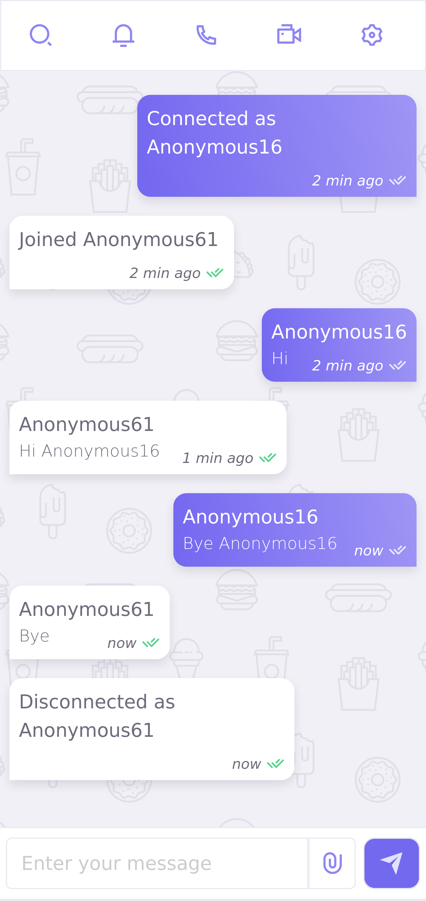

# Vuegram

[](https://www.gnu.org/licenses/gpl-3.0)

Simple websocket chat made with vuejs and aiohttp.




## Getting Started

### Installation
Create a virtual environment and install the dependencies:
```bash
python -m venv venv
source venv/bin/activate
pip install -r requirements.txt
```

### Usage
Run the aiohttp web server:
```bash
cd vuegram
python main.py
```
Invite multiple users to access your server's IP address (port 8080) through a browser, each will be assigned a random username.

## Authors
**Fernando M** - https://bitbucket.org/gmork2/

## License
This project is licensed under the GNU GENERAL PUBLIC LICENSE
Version 3 - see the [LICENSE](LICENSE) file for details.
